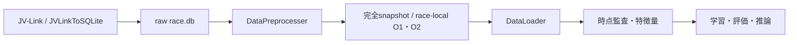

# ランキングMVP 詳細実装設計

## 1. 文書の位置付けと対象

状態: 実装設計案（2026-10-06）。[要件定義](requirements.md)、[仕様書](specification.md)、Accepted [ADR-009](decisions/ADR-009-use-lambdarank-mvp-and-top3-pl-extension.md)を、実装単位・データ契約・検証手順へ分解する。本書の作成は製品コードの実装や、新しいAPI・永続形式・データ加工規則の承認を意味しない。

本書では「確定仕様」「現行実装」「設計候補」「実装前決定」を区別する。新規モジュール、型名、CLI、設定項目、成果物形式はすべて設計候補であり、公開契約や長期的な依存関係は実装前に必要なADRへ記録する。[現行アーキテクチャ](../ARCHITECTURE.md)は実装済みの事実を示す正本として維持する。

MVPの確定仕様は次の範囲とする。

| 項目 | 確定仕様 |
| --- | --- |
| モデル | `LGBMRanker(objective="lambdarank")` |
| 教師ラベル | 確定着順1着=3、2着=2、3着=1、4着以下=0。例外の扱いは未決定。 |
| gain | ラベル0・1・2・3にLightGBM既定の0・1・3・7を対応させる。 |
| group | 同一レースの連続行ごとの行数。レースID配列ではない。 |
| 出力 | 各馬のレース内スコアと、その降順による順位。確率・EV・購入案は含めない。 |
| 評価対象 | JRA平地重賞G1・G2・G3。学習対象レースの範囲は別途決定する。 |
| 評価 | 主指標NDCG@3、補助指標Top1精度・Top3一致割合。レース単位の時系列検証。 |

年間回収率や購入額上限は後続の確率・購入段階に適用する。MVP完了を利益目標で判定せず、スコアにsoftmaxをかけて勝率と表示しない。top-3 PLは第14節の拡張境界に留める。

## 2. 現行の到達点と追跡関係

### 2.1. 実装済みの土台と不足

| 責務 | 現行実装 | MVPまでの不足 |
| --- | --- | --- |
| 取得 | `src/data/data_retriever.py`がJVLinkToSQLiteを介してhistorical/latest/realtimeを取得する。 | 取得済みという事実だけでは過去の判断時点での利用可能性を証明できない。 |
| オッズ保存 | `odds_archive.py`がRTのO1/O2を原列のまま累積archiveへ保存し、同一行を重複保存しない。 | 行ごとの受信時刻・改訂関係・発売対象馬との照合契約が未整備。 |
| 原本からの加工 | `DataPreprocesser`がread-only SQLiteから文字列とNULLを維持してParquetを公開する。`src/features/`が明示入力から特徴量別中間Parquetを生成し、`src/make_datamart/`がそれらを結合する。 | JRA-VAN業務コード解釈、受信履歴からの過去集計、原本Parquetから中間入力を作る変換は未実装。 |
| 公開 | 完全snapshotとrace-local O1/O2 versionを完成後にCURRENTで公開する。失敗時は従前の参照を維持する。 | snapshotの完成は、過去の出馬表・訂正履歴を保持したことを意味しない。 |
| 読み込み | `DataLoader`は完全表・Arrow batch・RaceKey指定のO1/O2をParquetから読む。 | 各読取でCURRENTを再解決するため、複数表を同一版へ固定する公開APIがない。 |
| CLI | `src/main.py`の取得フラグ、`preprocess rebuild`、`model audit/features/walk-forward`。 | train/predict成果物CLI、nested選定は未実装。特徴量中間テーブルとdatamartはPython APIから明示的に生成・保存する。 |
| モデル | ADR-009〜011によりLambdaRank境界、FeatureSchema、時点監査、race-level walk-forward、native成果物形式を決定し、`src/models/`と`src/features/`へ実装済み。 | JRA-VAN業務コードの解釈、過去集計、nested walk-forward、train/predict成果物の製品統合は未実装。 |

既存の`src/tests/test_data_pipeline.py`は、原本削除後のParquet読取、変換失敗時のCURRENT維持、対象レースだけのO1/O2公開を検証する。これを学習・推論や時点再現の検証済み証拠とは扱わない。

モデルMVPの実装済み範囲は、`src/models/`のRankingDataset、FeatureSchema、LightGBM学習・推論・評価、race-level walk-forward、native成果物の保存/再読込、`src/features/builder.py`の明示入力に対する特徴量生成・時点監査、および特徴量別中間テーブルとdatamartの保存・結合である。ラベル・gain・group・同点規則、欠損値を補完しない契約、承認済み特徴量allow-listと結果由来列の拒否を実装し、単体・統合テストで検証する。現時点のallow-listは事前能力値と履歴オッズであり、血統文字列などの中間列は数値FeatureSchemaへ自動投入しない。曖昧な最終オッズ列や新しい特徴量は時点・生成規則を確定してから明示的に追加する。JRA-VAN業務コードの解釈、過去集計、nested walk-forward、train/predict成果物、購入判断は未実装であり、上流の決定と別実装単位として残す。

### 2.2. 要件・仕様・ADRへの追跡

| 正本 | 本書の対応 | 完了証拠 |
| --- | --- | --- |
| REQ-01、SPEC-01、ADR-009 | 第6・9節の評価対象判定。購入対象の規定を学習範囲へ自動転用しない。 | 承認されたコード表による平地重賞判定と対象件数。 |
| REQ-09、SPEC-09、仕様3.1、ADR-009 | 第7〜9節の市場基準・LambdaRank。 | ラベル/gain/group、同時点の市場比較、外側評価の記録。 |
| REQ-10、SPEC-10・12・13、ADR-007・009 | 第3・4・10節の原本境界と時点監査。 | 発表・受信・固定時刻、出馬表、選択した原レコードの証跡。 |
| REQ-11、SPEC-11・14、仕様4.1、ADR-009 | 第9節のnested Walk-forwardと指標。 | 分割manifest、レース別指標、対応ありbootstrap。 |
| REQ-12、ADR-005・006 | 第3・11節の取得・設定境界。 | JVLinkToSQLite境界を維持し、秘密情報を持ち込まない。 |
| ADR-008 | 第3・5・12節のParquet参照と公開。 | モデルがSQLiteを開かず、固定した版から再実行できる。 |
| REQ-02〜08、SPEC-02〜08・15 | 後続段階。MVPの機能完了対象外。 | 本MVPで購入・利益の達成を報告しない。 |

## 3. データ経路、識別キー、原本保持

### 3.1. 維持する境界

[ADR-005](decisions/ADR-005-use-jvlinktosqlite-acquisition-boundary.md)〜[ADR-008](decisions/ADR-008-separate-raw-preprocessing-and-parquet-loading.md)の依存方向を維持する。モデルと特徴量コードは`race.db`やRT stagingを直接読まない。取得・raw加工とモデル処理は別の実行段階にし、推論が暗黙に外部取得を始める構造を避ける。

完全snapshotは`data/processed/snapshots/<snapshot-id>/`、realtimeは`data/processed/realtime/<race-id>/versions/<version-id>/`を参照する。処理開始時に完全snapshotと必要なrace-local versionのIDを解決し、処理終了まで固定する読取契約を追加する案とする。現行DataLoaderでこの固定が実現済みとはしない。ID、表名、存在、スキーマ、内容hashを検証し、許可された保存先の外へ参照を解決しない。

realtimeのversionにはO1/O2しかない。出馬表、騎手変更、取消、発走時刻・馬場変更の最新状態をこのversionだけで取得できるとは扱わない。完全snapshotの発走前状態が十分かを監査し、不足する履歴の取得・保存方式を決めてから推論へ進む。

### 3.2. 識別契約

| 対象 | 現物から確認した列・型 | 設計候補の使い方 |
| --- | --- | --- |
| レース | RA/SE/O1/O2の`idYear, idMonthDay, idJyoCD, idKaiji, idNichiji, idRaceNum`。processedはnullable string。 | 日付を検証して既存`RaceKey`へ変換。場・回・日・レース番号の2桁文字列を保つ。`race_id`は既存の年月日+4成分連結。 |
| レース内の馬 | SEのraw宣言主キーはレース6列+`KettoNum`。`Umaban`も存在する。 | 内部行の一意キー候補は`(RaceKey, KettoNum)`。オッズとの対応は固定時点の`(RaceKey, Umaban)`から引く。両者の対応を検証する。 |
| 馬の履歴 | UMのraw宣言主キーは`KettoNum`。 | 馬名を結合キーにせず、KettoNumで過去SEへ結ぶ。UM未一致を暗黙に行削除しない。 |
| オッズ観測 | archiveには主キー宣言がなく、`HappyoTime`とO1/O2原列がある。 | 原行hashと取得観測IDを参照する。RaceKey+HappyoTimeだけを一意キーと仮定しない。 |

Parquetにはrawの主キー・NOT NULLが強制制約として引き継がれない。キー欠損、馬番号重複、同一馬の多重結合、RA未一致、オッズの馬対応不成立を検出し、採用規則が決まるまで学習・公開を止める。先頭ゼロを落とす数値変換や、任意の先頭行を残す重複除去は行わない。

### 3.3. 物理変換と業務加工を分ける

[再処理記録](data-preprocessing/race-parquet-2026-10-06.md)と[物理定義](table-definition/README.md)では、全列string・NULL許容、原列名・列順の保存が確認されている。空白、ゼロ日付、特別なコード値の業務意味は未承認である。

型変換・欠損分類・結合・集計は別の派生データへ行い、入力snapshotを上書きしない。各変換規則に原列、単位・倍率、コード表の版、Why/Impact/Validation、規則IDを持たせる。文字列`"0"`、空白、NULL、未提供、適用外を同じ意味へまとめる判断も実装前決定とする。

## 4. 時点契約と利用可能性の監査

### 4.1. 時刻と証跡の候補契約

時刻はタイムゾーン付きで保存し、比較基準を統一する。表示はJSTとする案で、元の時刻文字列とその解釈根拠も保持する。日付だけの項目を便宜上0時に変換して、発走前に利用できた証拠へ置き換えない。

| 項目 | 意味・必須の確認 |
| --- | --- |
| `event_at` | レース・調教等が起きた時刻。利用可能時刻とは別。 |
| `published_at` | 提供元がその版を発表した時刻。O1/O2のHappyoTimeの書式・日付補完・改訂の意味を提供仕様で確認する。 |
| `received_at` | 利用システムがその版を受領した時刻。現在の取得時刻を過去の受信時刻として記録しない。 |
| `published_version` | 原行hash、元ファイル・取得観測ID、改訂順序等の証跡。 |
| `freeze_at` | 当該予測の入力固定時刻。以後の訂正・取消・オッズを特徴量や対象馬へ混ぜない。 |
| `scheduled_start_at` | 固定時点で把握した発走予定時刻とその版。事後の最終時刻で締切を遡って動かさない。 |
| `built_at` | snapshot・特徴量の生成時刻。発表・受信時刻の代用にはしない。 |

実運用再現では、採用する各版の発表と受信が`freeze_at`以前であることを確認する。遅れて受信した情報を発表時刻だけで採用しない。過去バックフィルでは、当時の受信証跡や利用可能性を裏付ける履歴がどこまで残るかを別に監査し、現在取得できたデータを当時このシステムが観測したと報告しない。

`headMakeDate`は列名から受信時刻と判断しない。`SY_PROC_FILES.PublishedDateTime/ProcessedAt`もファイルと個別レコード・改訂の対応が未確認であり、全行の時点証明として一律に使わない。現行archiveは原列保持と全行重複除去を行うが、独立した受信監査は追加していない。

### 4.2. 監査と選択の手順

1. 表・項目ごとの提供元仕様、日時書式、単位、改訂・取消、保持状況を確認する。
2. レース単位で固定時点の出馬表と馬番号対応を復元し、完全性と版の整合を確認する。
3. `freeze_at`までに利用可能な版だけを候補とし、その範囲で直近の発表・改訂を選ぶ。同一時刻で競合する版の優先規則は未決定なら止める。
4. 過去成績は、過去レースが終わっただけでなく、その結果の当該版が固定時点までに利用可能だったことを確認する。
5. 選択した観測、採用できなかった理由、監査根拠、不明な項目と件数を派生成果物へ保存する。

監査結果の候補区分は「運用時の受信証跡あり」「過去履歴の根拠あり」「利用可能性未確認」とする。区分の採用条件は実装前に定める。未確認の期間を時点再現済みと扱わず、最終オッズや事後更新された馬マスタで穴埋めしない。

同時点のオッズがない期間でも、特徴量・対象馬・結果の時点と意味を監査できるならランキング評価は可能である。ただし市場比較の対象に混ぜず、評価件数・期間・制限を別に報告する。オッズ履歴だけでなく特徴量の履歴も不明なら、時点を再現したランキング評価としては実行しない。

入力固定時刻は「発走5分前」と同一にしない。将来の提示期限までに取得・公開・特徴量・推論・表示が終わる余裕を実測から決める。時刻変更、情報の許容遅延、固定後の取消への対処は未決定表に残す。

## 5. モジュール責務と依存方向

既存`src/data/`の責務を維持する。実装済みの配置と、今後の候補を次に示す。

| 配置候補 | 責務 | 依存・境界 |
| --- | --- | --- |
| `src/data/loader/read_parquet.py`とfacade | 完全snapshot・race-local versionの固定読取契約を追加する候補。 | Parquetのみ。既存のCURRENT読取との互換性を設計する。 |
| `src/features/builder.py` | 承認済み規則に従う明示入力の投影、欠損保持、時点監査。 | `FeatureInput`のfreeze/available時刻を検証し、取得処理を呼ばない。結果ラベルを特徴量へ流さない。 |
| `src/features/previous_race_result.py` | 前レース結果の中間テーブル生成。 | 正規化済み入力のみを受け、Parquet保存は共通のテーブル契約へ委譲する。 |
| `src/features/odds_ratio.py` | オッズ比率の中間テーブル生成。 | オッズ履歴不足はNULLで保持し、補完や最終オッズへの暗黙 fallback を行わない。 |
| `src/features/pedigree.py` | 血統識別子の中間テーブル生成。 | 文字列を保持し、未承認のカテゴリ符号化を行わない。 |
| `src/features/feature_table.py` | 特徴量中間テーブルの共通スキーマ、時点監査、Parquet入出力。 | feature名・列・キー重複・`available_at <= freeze_at`を検証する。 |
| `src/make_datamart/builder.py` | 保存済み特徴量中間テーブルの読み込み、順序を保つleft join、datamart保存。 | 余分なキー、`freeze_at`不一致、列衝突を拒否し、特徴量ごとのavailable時刻を残す。 |
| `src/models/ranking_dataset.py` | 行キー、ラベル、連続レース行、group、型・順序の検証。 | 既に生成された特徴量と別経路の結果を結合する。 |
| `src/models/train_model.py` | LightGBMの構築・学習と学習記録。 | 検証済みデータ、設定、明示した乱数・実行条件。SQLite・CLIに依存しない。 |
| `src/models/evaluate_model.py` / `walk_forward.py` | レース別指標とrace-level時間順分割。 | train/validation/testを同一レースから分離せず、train以外を学習へ渡さない。 |
| `src/models/predict_model.py` | 保存した特徴量契約とモデルによる1レースのscore/rank生成。 | 学習と共通の特徴量計算。確率化や購入方策を持たない。 |
| `src/models/artifacts.py` | モデル・manifest・予測・評価の検証済み公開と再読取。 | ファイルI/Oを集約し、実行可能オブジェクトの任意復元を避ける。 |
| `src/main.py` | `model audit/features/walk-forward`のJSON入力検証と呼出し。 | 外部取得を暗黙に開始せず、既存取得CLIを維持する。 |

依存は`CLI → モデルの処理編成 → 特徴量/データ契約 → DataLoader`、保存は明示した成果物境界へ向ける。特徴量やloaderがモデル・CLIをimportしない。時刻・乱数・設定・パスを明示引数にし、import時の処理や隠れたグローバルクライアントを作らない。

## 6. 入出力データ契約の候補

### 6.1. 候補スキーマ

内部の軽量なdataclassとArrow Tableを第一候補にする。Python型名と永続形式は未承認であり、新しい検証フレームワークやpandasを暗黙に導入しない。

| 契約候補 | 必須要素・型の候補 | 検証 |
| --- | --- | --- |
| `InputReference` | snapshot ID、RaceKeyとrealtime version ID、schema/content hash（string）。 | 存在、固定参照、RaceKey一致、hash一致。学習で不要なrealtime参照は持たせない。 |
| `RaceContext` | RaceKey、freeze/start時刻、固定時点の馬集合、対象判定、監査参照。 | 馬集合の一意性、対象コード表の版、利用可能性、必要履歴。 |
| `FeatureSchema` | 規則ID、列名の順序、数値/カテゴリ型、単位、NULL/未知カテゴリ方策。 | 重複列、未承認規則、非有限値、期待型、特徴量の漏れ・追加を検出。 |
| `FeatureRows` | race_id・KettoNum・Umaban（string）、freeze_at、特徴量列、原行参照。 | 1レース1馬1行。識別列・監査列はモデルのXから除く。 |
| `LabelRows` | race_id・KettoNum、確定着順原値、確定版、例外分類、label（整数）。 | 特徴量と別に保持。通常結果だけ確定した3/2/1/0変換を適用する。 |
| `RankingDataset` | XのN行F列、yのN行、groupのR要素、行キー、split参照。 | 同レースが連続し、`sum(group)=N=len(y)`、group正整数、キー重複なし。 |
| `PredictionRows` | race_id、KettoNum、Umaban、score（有限float）、rank（整数）。 | 対象馬全頭、同じモデル/時点/入力参照。確率・EV・買い目の列を作らない。 |
| `EvaluationRows` | race_id、fold、freeze_at、3指標、市場3指標、差、監査区分。 | 同一レース・馬集合・時点の比較だけ差を作る。 |

順位を付けるにはスコア同値規則の合意が必要である。合意前に馬番号順・入力順・乱数による解決を実装の既定値にしない。結果同着、取消・除外、競走中止、失格、3頭未満の学習・評価規則も未確定なら実行を止め、対象件数を監査報告へ残す。

### 6.2. ラベルと漏洩防止

`NL_SE_RACE_UMA.KakuteiJyuni`はラベル候補の原列であり、`NyusenJyuni`と同じと仮定しない。`IJyoCD, DochakuKubun, DochakuTosu, headDataKubun`等の意味を確認して、通常結果と例外を判定する。空白・ゼロ・不正着順を4着以下=0へ落とさない。

Xは承認された特徴量の列allow-listから組み立てる。ラベルとの結合後に「数値列すべて」を選ぶ処理は禁止する。対象レースの確定着順・タイム・着差・通過順位・上がり・賞金・最終オッズ・人気・払戻はXに入れない。これらを過去成績に使う場合も第4節の時点条件を満たした過去版に限定する。

## 7. 特徴量の設計候補と加工判断

以下の原列の存在は[RA](table-definition/NL_RA_RACE.md)、[SE](table-definition/NL_SE_RACE_UMA.md)、[UM](table-definition/NL_UM_UMA.md)、[O1 archive](table-definition/ARCHIVE_O1_ODDS_TANFUKUWAKU.md)、[坂路](table-definition/NL_HC_HANRO.md)で確認した。業務意味、単位、倍率、コード値、欠損記号、発表時刻は別途確認が必要である。候補の列名・型は採用決定ではない。

| 候補 | 具体的なソース列 | 派生型候補 | 時点・欠損・集計の条件 |
| --- | --- | --- | --- |
| レース条件 | RA.`Kyori, TrackCD, CourseKubunCD, GradeCD, JyokenInfoSyubetuCD, JyokenInfoJyuryoCD`、`idJyoCD` | 距離int32、コードcategory | 固定時点の版。コード値と平地/重賞判定を確認。欠損時の採否を決める。レース共通列だけでは馬を区別できない。 |
| 枠・馬番号 | SE.`Wakuban, Umaban` | int32またはcategory | 固定時点の出馬表から使用。識別文字列も保存し、数値としての効果を採るか内側で比較。変更・欠損は未決定。 |
| 年齢・性別 | SE.`Barei, SexCD` | int32/category | 当該時点の値。UMの最新行による置換はしない。BirthDateから再計算する年齢定義も要合意。 |
| 負担重量 | SE.`Futan, FutanBefore` | float64 | 単位・倍率と変更版を確認。Before列を最新版選択の代わりにしない。欠損補完の有無は別決定。 |
| 騎手・調教師 | SE.`KisyuCode, ChokyosiCode` | category | 固定時点の担当者。未知カテゴリ規則を保存。コードの単純数値大小を意味としない。 |
| 馬体重・増減 | SE.`BaTaijyu, ZogenFugo, ZogenSa` | float64/int32 | 固定前の発表と受信を確認できる場合の候補。未発表と不正値を区別。発表が間に合わない場合の規則を決める。 |
| 天候・馬場 | RA.`TenkoBabaTenkoCD, TenkoBabaSibaBabaCD, TenkoBabaDirtBabaCD` | category | 結果時点の値を固定時点の値と扱わない。履歴不明なら採用できない。適用外と欠損の区分を定める。 |
| 休養間隔・出走数 | 過去SE.`KettoNum`とレース6列、過去RAのレース日付 | int32 | 固定前に既知の過去出走だけを時点順集計。初出走・履歴未取得・同日出走の判定を区別する。 |
| 過去上位成績 | 過去SE.`KakuteiJyuni`、過去RA.`Kyori, TrackCD, GradeCD` | float64、件数int32 | 直近n走または一定期間、距離/馬場条件別は候補。窓幅・重み・最小件数・平滑化は内側で選ぶ承認済み候補集合から決定。 |
| 過去走力 | 過去SE.`Time, HaronTimeL3, TimeDiff`、過去RA.`Kyori` | float64 | 単位、距離差、条件差の扱いを確認。補正・外れ値処理を勝手に決めず、単純値/条件内集計を比較候補にする。 |
| 騎手・調教師成績 | 過去SE.`KisyuCode, ChokyosiCode, KakuteiJyuni` | float64、件数int32 | 固定前の結果から集計。現在のKS/CH累積値を過去へ配らない。対象範囲・窓幅・平滑化・新規担当者規則は未決定。 |
| 血統 | UM.`Ketto3Info0HansyokuNum`等 | category | 項目の世代・親対応を確認し、時点証跡がある版に限定。SE→UM未一致を理由に行を消さない。高いカテゴリ数の影響を内側で検証。 |
| 調教 | HC.`KettoNum, ChokyoDate, ChokyoTime, HaronTime4, LapTime1` | float64、件数int32 | 調教実施時刻と提供時刻を別に確認。直近値/期間集計は候補で、未取得と調教なしを同一視しない。 |
| 同時点市場 | O1.`HappyoTime, OddsTansyoInfo{k}Umaban, OddsTansyoInfo{k}Odds` | float64 | slotのUmabanで固定出馬表へ対応させる。slot位置=馬番号と仮定しない。倍率・特殊値を確認し、有限で正の値を検証。採用と市場を使わないモデルの比較は内側のみ。 |

O2は取得・公開済みだが、馬連からの特徴量をMVPへ自動採用しない。オッズ推移や組合せ集計は取得時点・発売対象・集計方法を別途定めてから追加する。SE.`Odds/Ninki`、NLの最終オッズを同時点市場の代用品にしない。UMの賞金・着度数等の現在累積値も過去評価へ直結しない。

### 7.1. 加工規則を採用する際の判断記録

| 未合意の判断 | Why | Impact | Validation / 決定方法 |
| --- | --- | --- | --- |
| 数値化・コード分類 | モデルが扱える意味のある型を作る。 | 誤った倍率・欠損分類で意味が変わる。 | 提供仕様・小さな検査fixture・変換前後件数。実装前に項目単位で承認。 |
| 欠損を保持/補完/特徴量不採用 | 利用可能な情報と欠測の影響を区別する。 | 補完や行除外で母集団が変わる。 | 理由別件数と内側性能を比較。補完統計は各学習期間だけから作る。 |
| 履歴窓・条件別集計・平滑化 | 過去情報の関連性と疎な群の不確実性を扱う。 | 最新データ、窓外、少数標本の効果が変わる。 | 手計算可能な境界fixtureと内側比較。窓/最小件数/重みの候補範囲を先に合意。 |
| 外れ値処理・丸め・標準化 | 特殊値や測定単位を適切に扱う。 | 走力や順位関係を変える可能性がある。 | 原値分布と提供仕様を確認。必要性がなければ追加しない。 |
| カテゴリ符号化 | 列順と未知値を学習・推論で揃える。 | 未来カテゴリや結果由来の符号化が漏洩を作る。 | 辞書を学習期間のみで固定して保存。未知・NULL・追加列の試験。 |
| 学習レース範囲 | 重賞だけの標本数と広い母集団の差を比較する。 | JRA平地全体/重賞のみ等で分布と費用が変わる。 | 承認した範囲候補を内側期間で比較し、外側/holdoutは選択に使わない。 |

全候補を既定で採用するfeature setは作らない。学習開始時に、採用列、規則ID、履歴窓、欠損・未知値方策、対象範囲が決定済みかを検証する。不足時は具体的な未決定項目を返し、学習実装が任意の補完・除外・学習範囲を選ばない。

## 8. 学習処理の詳細

1. 第15節で必要な判断を確定した設定、固定入力参照、監査結果、分割manifestを読む。
2. 各レースの固定時点を使って、採用済み特徴量と対象馬集合を生成する。結果は別のLabelRowsへ構築する。
3. 行キーでXとyを照合し、対象レースを欠けた馬だけで学習する変更を行わない。例外は承認済み規則に従って件数・理由を記録する。
4. レースを時系列順に並べ、同レース内を保存した行順にする。例として4頭・5頭の2レースならgroupは`[4, 5]`であり、各行のrace_idではない。
5. X、y、group、ラベル範囲、列allow-list、型・有限性・カテゴリ辞書、評価groupの対応を検証する。
6. 内側の過去期間だけで特徴量集合・学習範囲・ハイパーパラメータ・学習停止条件を比較し、選定記録を固定する。
7. その選定を外側の過去学習期間へ適用し、未来の外側評価レースを予測する。外側結果を見た再調整は別実験として記録し、同じ外側を独立評価と称さない。
8. 全工程が成功した候補モデルを第12節の成果物として公開する。

最小の学習呼出し概念は`LGBMRanker(objective="lambdarank").fit(X, y, group=group)`である。評価データにも独立したgroupを渡す。[公式LGBMRanker API](https://lightgbm.readthedocs.io/en/stable/pythonapi/lightgbm.LGBMRanker.html)に従い、評価引数、callback、early stoppingは採用版のAPIを確認して固定する。APIの版差を隠すための推測コードは置かない。

gainは確定した既定0/1/3/7を検証する。[公式Parameters](https://lightgbm.readthedocs.io/en/stable/Parameters.html#label_gain)を根拠とし、gainをラベル3/2/1/0そのものへ変更しない。`eval_at`による@3評価と`lambdarank_truncation_level`の学習設定は別であり、評価@3からtruncation=3を自動決定しない。

`num_leaves, max_depth, learning_rate, n_estimators, min_child_samples`等は調整候補であり最適値は未確定。乱数seed、thread数、決定性の設定、CPU・メモリ予算も明示的な実行設定として保存する。学習停止回数を外側評価や最終holdoutで決めない。

## 9. 時系列検証と評価

### 9.1. nested拡大型Walk-forward

分割単位はレースとし、同じレースの馬を学習・調整・評価へ分けない。各外側foldを`過去学習領域T_k → 未来評価領域E_k`とし、T_kの内部でも`過去学習 → 未来検証`を拡大型で反復する。内側だけで特徴量、範囲、パラメータ、欠損処理の学習統計を選定する。

最終holdout Hは全外側評価より未来に設け、実験の選択を完了するまで参照しない。選定方針を固定してHより前の承認済みデータから学習し、Hを一度評価する。再選択すればHを最終の未使用期間とは呼べない。

期間境界、初期学習期間、fold数、最終holdout期間、同日レースの境界処理は未決定である。結果の利用可能時刻を確認し、学習ラベルが各評価時点より未来に公開されたものを取り込まない。具体的な年月日や最低件数を本書で勝手に指定しない。

分割manifestには、レースID、期間、学習/内側検証/外側評価/holdoutの役割、入力固定時刻、対象範囲、規則、件数を保存する。対象外・未確認・例外は理由を別記し、モデルに有利なレースだけを事後に選ぶ処理を禁止する。

### 9.2. 指標の式

上位3頭が一意に定まる通常結果について、予測順位mの馬を`σ(r,m)`、ラベルをy、レース数をRとする。

$$
\mathrm{DCG@3}_r=\sum_{m=1}^{3}\frac{2^{y_{\sigma(r,m)}}-1}{\log_2(m+1)},\quad
\mathrm{NDCG@3}_r=\frac{\mathrm{DCG@3}_r}{\mathrm{IDCG@3}_r}
$$

IDCG@3はそのレースのラベルを降順に並べたDCG@3とする。主指標は`(1/R) Σ_r NDCG@3_r`で、頭数による重み付けをせず各レースを等重みで扱う。

$$
\mathrm{Top1}=\frac{1}{R}\sum_r \mathbf{1}[\hat{w}_r=w_r],\qquad
\mathrm{Top3}=\frac{1}{R}\sum_r\frac{|\hat{A}_{r,3}\cap A_{r,3}|}{3}
$$

Top3は予測と実際の上位3頭集合の共通頭数を評価し、順序は評価しない。スコア同値、同着、3頭未満、IDCG=0等へ式を拡張する規則は実装前決定である。未決定例外を自動除外せず、評価不能なら報告して実行を止める。

### 9.3. 市場比較と不確実性

同じfreeze_atの完全な発売対象馬集合と、全対象馬の有限で正の単勝オッズを確認したレースだけで、オッズ昇順の市場ランキングを作る。市場の同値オッズも順位規則の決定対象に含める。モデルと市場で馬集合・レース・時点が異なる指標を引き算しない。

`d_r=NDCG@3_model,r−NDCG@3_market,r`の算術平均を示す。対応ありレースbootstrapは、同じ評価レースIDを復元抽出し、そのレースのモデル・市場の対を一緒に取り出して平均差を再計算する。馬行やモデル・市場を独立に抽出しない。95%CIの方式、反復回数、seedを先に定めて保存する。区間が0をまたぐ場合は優位性未確認と報告する。

ランキング単独と市場比較可能な部分集合の件数・期間・理由を併記する。CIだけで期間依存や少数重賞の不確実性が消えるとはしない。MVPスコアにLog Loss/Brier Scoreを直接適用せず、回収率や確率校正をMVPの成果として出さない。

## 10. 推論フローと異常時の動作

### 10.1. 1レースの処理

1. 対象RaceKey、承認済みモデル参照、入力固定時刻を明示して開始する。
2. 先行取得・加工の成功を確認し、完全snapshotとrace-local O1/O2 versionを固定する。出馬表・取消等の必要履歴も確認する。現行O1/O2だけで完結する手順にしない。
3. モデルのfeature schema/configと同じ規則を使い、固定時点の対象全馬からXを作る。推論にラベル表は渡さない。
4. 欠損・未知カテゴリ・版・列順を検証してスコアを計算し、承認された同値規則で順位を付ける。
5. 対象全馬、モデルID、入力版、freeze_at、完了時刻と監査参照を検証し、予測を一単位で保存・提示する。

過去レースで学習側の特徴量生成と推論側の生成を同じ入力・時点へ適用し、同じ列・型・値になることを検証する。学習時だけ結果表由来の便利な列を使う経路を作らない。

### 10.2. 失敗・再実行

| 状況 | 動作の設計候補 |
| --- | --- |
| 入力版不存在、hash/schema不一致 | エラーとして終了。別のCURRENTやrawへ暗黙に切り替えない。 |
| 時点監査不成立・対象馬不完全 | 予測を公開せず、対象と理由を記録する。任意の馬行削除で続行しない。 |
| 未決定の欠損・例外・同値 | 未決定項目と件数を返す。既定規則を生成しない。 |
| LightGBMなし・非互換モデル | 学習/推論開始前に依存・形式を検証し、明示して終了する。 |
| 取得遅延・締切超過 | 将来の運用規則確定まで、古い予測を新時点の予測として再表示しない。 |
| スコアNaN/無限、対象行欠落 | 公開を中止し、失敗記録と従前の公開参照を保持する。 |
| 保存失敗・中断 | 未完成物を公開しない。同じ固定入力で再実行し、成功まで従前の参照を維持する。 |

失敗時に既存参照を保持することと、その古い成果物が現在も利用可能なことは別である。表示時には予測の時刻と入力版を確認する。再実行IDと重複公開の扱い、締切後・取消後の表示規則は実装前に定める。

## 11. 設定とCLIの候補

### 11.1. 設定の所有

既存`config/data.toml`はraw/processed/runtimeパス、`config/jvlink.toml`は取得profileと対象RaceKeyを所有する。[ADR-006](decisions/ADR-006-config-driven-jvlink-settings-and-typer-cli.md)を維持し、モデル設定に取得XMLや秘密情報を複製しない。

`config/model.toml`を追加する候補とし、標準ライブラリtomllibで読む。用途別の最小設定は次のとおりとする。

| 設定候補 | 内容 |
| --- | --- |
| input | 明示したsnapshot/version参照、監査manifest参照、固定時点規則ID。 |
| features | 採用feature schema ID、変換・欠損・カテゴリ・集計規則ID。 |
| training | 対象範囲、objective=lambdarank、承認済み探索範囲、seed、thread/資源条件。 |
| evaluation | 内側/外側/holdoutの期間、対象判定、指標、同値/例外規則、bootstrap設定。 |
| artifacts | 派生データ・モデル・予測・評価の保存先、公開単位と形式版。 |

モデル固定の仕様を自由に変更できる設定として解放しない。未知項目・未決定規則・矛盾する期間・出力先の原本との重なりを拒否する。CLIと設定の優先順位、相対パスの基準、設定版の移行もAPIと一緒に確定する。

### 11.2. コマンド案と既存との区別

実装済みなのは`uv run python src/main.py --retrieve --mode=historical/latest/realtime`、`uv run python src/main.py preprocess rebuild`、およびJSON入力を受ける`model audit/features/walk-forward`である。Parquetの業務列から特徴量を作る変換とtrain/predict成果物コマンドは別実装単位として残す。

| コマンド案 | 入力 | 成果物 |
| --- | --- | --- |
| `model audit` | schema ID・feature names・freeze/available時刻を含むJSON。 | 時点・欠損・利用可能性の監査報告。 |
| `model features` | 承認済みschemaと時刻付きFeatureInput JSON。 | 欠損を保持したFeatureRowsと監査結果。 |
| `model walk-forward` | 着順付きFeatureInput JSONとrace-level分割設定。 | 拡大型Walk-forwardのfold境界と指標。 |
| `model train` | 固定した選定設定、承認済み学習範囲。 | モデル一式と再現manifest。 |
| `model predict` | モデルID、RaceKey、入力参照、freeze_at。 | score/rankと実行・監査情報。 |

取得フラグとの併用は現行サブコマンドの規則に合わせて拒否する。コマンドは入力・必須決定事項を先に検証し、時点監査に失敗した場合は外部取得や学習を開始しない。終了コードは監査・入力契約違反時に1、JSON出力はUTF-8の標準JSONとし、欠損NaNは`null`へ変換する。

## 12. 成果物と再現性

特徴量中間テーブルとdatamartは、呼び出し元が明示したParquetパスへ保存する。共通スキーマ、feature名、列、時点、キーを保存時と再読込時に検証し、既存の完全snapshotを上書きしない。運用上の標準配置は派生データ`data/interim/`または専用のprocessed派生領域とし、モデル・予測`models/`、評価`reports/`を別領域に置く。保持期間や公開ポインタは未決定である。

| 保存物候補 | 再現に必要な内容 |
| --- | --- |
| モデル | LightGBM native modelと形式・採用版。pickleによる任意オブジェクト読取は導入しない。 |
| feature schema | 列順・型・単位・カテゴリ辞書・欠損方策・集計規則・結果列allow-list検証。 |
| config | 正規化した実行設定、選定値と探索範囲、同値・例外規則、seed・実行条件。 |
| input manifest | 完全snapshot、realtime version、表schema/content hash、RaceKeyとfreeze_at、原行参照。 |
| availability audit | 発表/受信の根拠、版選択、対象馬集合、未確認・例外の件数と理由。 |
| revision | コードcommit、依存lock hash、Python/LightGBM等の版、実行環境と決定性の条件。 |
| split/selection | 内側・外側・holdoutのレース一覧と役割、各選択を行った期間と指標。 |
| predictions/metrics | レース別score/rank、3指標、市場との対応、平均差・CI、件数・期間・制限。 |

一時領域に全構成物を書き、schema・hash・件数・参照整合を検証してから新しい不変の成果物IDを公開する案とする。公開ポインタを導入する場合は完成後だけ原子的に切り替える。公開に失敗した場合は従前の参照を保持する。原本、入力snapshot、既存モデルを上書きせず、旧版の削除は別の保持方針で定める。

再読取時にはモデルの列順/型/依存互換性と入力参照を検証する。同一環境・固定入力で同じ予測を再生成できることを試験し、環境差の許容誤差は実測前に固定値を宣言しない。データはGitへ含めず、提供元の利用・保存条件を確認する。

## 13. 実装単位、依存順序、受入条件

実装は下表の依存順で分割する。表の「決定済み」は、本書に候補が書かれたことではなく、仕様/必要なADRで承認されたことを指す。

| 単位 | 先行条件 | 実装・意味のある試験と受入条件 |
| --- | --- | --- |
| 1. データ契約・監査 | 提供仕様/コード/単位、履歴、利用条件の確認。 | 誤日付、空白/NULL/ゼロ、キー重複、競合改訂、発表前・受信遅延・固定後の情報を小さなfixtureで検出する。未確認を利用可能と報告しない。 |
| 2. 固定版読取 | snapshot/version API・互換性の決定。 | 読取途中にCURRENTが切り替わっても同じ版を読む。版不存在/パス逸脱を拒否。rawがなくても読む。既存公開失敗試験を維持する。 |
| 3. 対象馬・結果 | 出馬表履歴と取消/同着/失格等の規則。 | 固定後の変更を過去の馬集合へ反映しない。Umaban↔KettoNumの多重結合や不足を検出。ラベル3/2/1/0とgain7/3/1/0を確認。 |
| 4. 特徴量 | 採用列・加工・欠損・カテゴリ・履歴窓の決定。 | 現レースの結果列を追加してもXへ入らない。未来結果の追加で過去Xが変わらない。集計境界・補完統計・未知カテゴリと学習/推論一致を検証。 |
| 5. 市場基準・分割 | 対象期間、同値、評価例外、CI方式の決定。 | レースがsplitをまたがず、内側→外側→Hの時間順を検証。同時点不一致と不完全オッズを比較対象にしない。市場のみでも指標を算出できる。 |
| 6. LightGBM境界 | 依存追加と採用版の承認、1〜5の成立。 | pyproject/uv.lockを同時更新。小さな複数レースでgroup誤用、列順不一致、非有限スコアを検出。save/load後の予測を確認する。 |
| 7. 学習・評価 | 内側選定規則、資源条件、6の成立。 | 外側/Hの結果を選定処理へ渡さない。手計算できる完全順・逆順・集合一致で3指標を検証。対応bootstrapがモデル/市場の対を維持する。 |
| 8. 推論・保存・CLI | 公開形式/設定/締切・再実行規則、1〜7の成立。 | 固定入力から全馬score/rankのみを出す。保存中断・破損model/schema・CURRENT切替を試験し、失敗時に既存参照を保持する。CLI不備で副作用を始めない。 |

統合試験はテスト所有の小さな原表とParquetで「公開→固定読取→時点選択→特徴量→学習/評価→保存/再読取→推論」を確認する。通常試験で実データ・JRA-VAN・外部通信・認証を要求しない。手計算可能な期待値と境界違反の検出を優先し、単に関数が呼ばれたことだけを試験しない。

各単位で近いpytestを先に実行し、変更に応じた全体Ruff format/check、mypy、pytest、および必須のguard回帰を実行する。依存追加時はWindows環境・公式APIとの互換性も検証する。文書作成だけの本変更で、未実装モデルの試験を成功済みと報告しない。

性能測定は読み込む表・列・行数、batch幅、ディスク量、ピークメモリ、取得/加工/特徴量/推論/公開の処理時間を分ける。現行batch読取を活用するが、LightGBM学習の全データが自動的に定量メモリへ収まるとは仮定しない。数値目標と測定対象の規模は未確定である。

## 14. PL拡張との境界

MVPの入力時点・対象馬・feature schema・レースgroup・分割・成果物監査は後続PLで再利用する候補である。PLは別objectiveと学習済みモデルとして実装し、custom lossの微分と校正を別途検証する。MVPスコアの後処理をPL学習の代用にしない。確率、券種別EV、購入額最適化、予算・精算・画面は本設計の実装単位に追加しない。

## 15. 実装前に決める事項

| ID | 判断と未確定の理由 | 候補 | 決定時期 | 影響 |
| --- | --- | --- | --- | --- |
| DEC-01 | 発表/受信/改訂履歴と利用可能性。現行原列だけで行単位の時点を証明できない。 | 既存履歴の対応監査、追加の時刻付き観測保存。 | 監査単位1前。 | 過去評価可能期間と追加データ契約。 |
| DEC-02 | 出馬表・取消・騎手等の時点版。realtime公開はO1/O2のみ。 | 監査済み完全snapshotを使用、必要な履歴を追加取得/保存。 | 単位3前。 | 推論開始の可否と対象馬完全性。 |
| DEC-03 | 固定読取API・参照hash。現行は各呼出しでCURRENT再解決。 | 不変参照を受けるreader/facadeの契約。 | 単位2前、必要なADR。 | 公開API互換性、再現性、複数表整合。 |
| DEC-04 | コード表・単位・欠損記号。物理定義は業務意味を確定していない。 | 提供仕様による項目別規則と版。 | 単位1・4前。 | 対象判定、型、誤補完・誤集計。 |
| DEC-05 | 採用特徴量・欠損・カテゴリ・履歴集計。母集団と結果を変える。 | 第7節の候補を承認し、内側期間で選定。 | 単位4前。 | 必要なデータ、feature schemaと比較条件。 |
| DEC-06 | 学習レース範囲。評価対象からは一意に決まらない。 | JRA平地重賞のみ/JRA平地の広い範囲等を内側で比較。 | 学習データ構築前。 | 標本数、分布、計算量。 |
| DEC-07 | 同着・取消・中止・失格・3頭未満・結果未確定。正本でも未決定。 | 例外別のラベル・対象・評価規則を仕様化。 | 単位3・5前。 | 対象件数、ラベル、指標。無断除外しない。 |
| DEC-08 | score/市場オッズ同値の順位規則。指標に影響する。 | 決定的な順序規則/同値の評価規則を比較して合意。 | 単位5・8前。 | rank、NDCG、Top1/3と再現性。 |
| DEC-09 | split期間とCI方式・反復数。対象期間と不確実性の条件は未合意。 | 拡大型nested split、最終H、対応ありレースbootstrapの具体設定。 | 評価開始前。 | 独立評価、標本数、CI精度。 |
| DEC-10 | LightGBMの採用版と追加依存。現行依存はpyarrow/Typerのみ。 | 公式API、ライセンス、Windows/型検査/保存互換性を確認して追加承認。 | 単位6前、必要なADR。 | pyproject/uv.lock、動作環境と永続形式。 |
| DEC-11 | パラメータ探索・early stopping・seed/thread。最適値と資源条件は未検証。 | 内側で比較する承認済み探索範囲。 | 学習開始前。 | 過学習、決定性、所要時間。 |
| DEC-12 | 固定時刻・遅延・発走変更・締切後の扱い。性能数値目標なし。 | 実測に基づく余裕時間と利用可否規則。 | 運用推論前。 | 発走5分前の将来提示期限、古い表示の扱い。 |
| DEC-13 | CLI/config/schema/artifact形式と保持。新しい永続契約になる。 | 第6・11・12節の候補を最小契約として確定。 | 各公開単位前、必要なADR。 | 互換性、再実行、容量、ロールバック。 |

LightGBM依存とnative成果物形式はADR-010で採用を決定し、具体的な依存版は`pyproject.toml`と`uv.lock`へ固定した。numpy/pandas/scikit-learn等も必要性と実際の依存関係を確認し、未導入のAPIを存在する前提で設計コードへ埋め込まない。

実装開始の判断点、選択肢、影響と検証方法は本節と第13節に示す。決定後に仕様/ADRへ反映して該当単位を実装する。
