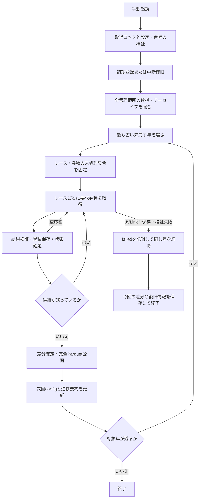

# JRA-VANオッズ履歴の手動週次取得 実装設計書

## 1. 文書の位置付け

状態: 実装済み設計（2026-10-09）。本書は、合意した取得要件を処理単位、状態管理、設定更新、障害復旧、検証条件へ落とし込み、実装時の契約を記録する。JV-Link実機の正常空応答判定だけは、実機仕様確認まで安全側の失敗扱いとする。

「確定要件」はユーザーが指定した運用方針、「現行実装」は現在の作業ブランチで確認した機能、「残る確認事項」は実機仕様に依存する範囲を表す。[現行アーキテクチャ](../ARCHITECTURE.md)と[モデルの実装設計](implementation-design.md)は、実装済み機能とモデル側の設計をそれぞれ扱う。

公開CLI、取得状態の永続形式、実行設定の生成は[ADR-013](decisions/ADR-013-manual-yearly-odds-acquisition.md)と[ADR-014](decisions/ADR-014-separate-basic-and-historical-odds-cli.md)で決定した。[ADR-006](decisions/ADR-006-config-driven-jvlink-settings-and-typer-cli.md)の設定所有、[ADR-007](decisions/ADR-007-archive-realtime-odds-for-training-and-inference.md)の累積アーカイブ、[ADR-008](decisions/ADR-008-separate-raw-preprocessing-and-parquet-loading.md)のParquet公開を維持する。

## 2. 確定要件と対象範囲

| ID | 確定要件 | 本書での対応 |
| --- | --- | --- |
| ACQ-01 | オッズ履歴のようなリアルタイム系データは、1年分の取得に約1日を要する。 | 最大1暦年を処理単位とし、レースごとに保存・進捗確定する。約1日はユーザー提示の所要時間であり、処理を24時間で打ち切る規則ではない。 |
| ACQ-02 | 1週間ごとにCLIを手動実行し、取得差分を管理する。 | 手動起動して終了するCLIを用意する。週1回は運用上の目安とし、起動頻度の制限は設けない。 |
| ACQ-03 | 取得差分に応じてconfigを更新する。 | 固定の取得方針と可変の進捗を分け、進捗から次回用の実行TOMLを生成・更新する。 |
| ACQ-04 | 初期登録時にアーカイブ行がないレース・券種を、提供元欠損とは判定しない。 | 初期状態は `pending` として取得対象にし、`provider_missing` は実取得結果または明示確認でのみ記録する。 |
| ACQ-05 | タスクスケジューラでは実行しない。 | 利用者の手動実行を入口とする。タスク登録、サービス、cron、常駐処理を追加しない。 |
| ACQ-06 | 火曜日であっても取得を試みてよい。 | 曜日判定・火曜の実行抑止を設けない。メンテナンスによる実行失敗は通常の失敗として扱う。 |

最初の実装対象は `0B41`（O1: 単勝・複勝・枠連）と `0B42`（O2: 馬連）の履歴取得である。対象競馬場はJRAのコード `01`〜`10` とし、中山だけに限定しない。学習対象の重賞フィルタを取得範囲へ流用しない。

予測時の `realtime`、基礎データの `historical-basic`、履歴オッズの `historical-odds`、日々の `latest` はそれぞれ分離した責務を持つ。他のリアルタイム系DataSpecは、対象キー、保存先、提供期間、0行応答の意味を確認してから別途対応する。すべての速報系DataSpecを年単位で取得可能とは仮定しない。

## 3. 現行実装と不足する機能

| 対象 | 現行実装 | 追加する設計 |
| --- | --- | --- |
| 原本DB | `config/data.toml` の `raw_db` が `data/raw/race.db` を参照する。 | 既存の設定パスを使用する。存在しない `raw.db` を新規作成・代替しない。 |
| 取得入口 | `uv run python src/main.py --retrieve --mode=historical-basic/latest/realtime`。 | `historical-odds` による手動年単位取得の入口を追加する。 |
| 対象レース | `NL_RA_RACE` の開始日以降をキー順で走査する。 | 対象年の上下限、今回の候補集合、終了条件を明示する。 |
| 取得済み除外 | `historical_odds.skip_existing` によってO1/O2を個別に除外する。 | `provider_missing` と取得済みを除外し、未試行・失敗分を再開する。 |
| 累積保存 | RTテーブルから同じ列構造のARCHIVEテーブルへ、全行一致の重複除去で保存する。 | 要求したレース・DataSpecの保存件数を返し、直後に進捗を確定する。 |
| 戻り値 | 履歴取得は要求レース数、アーカイブはO1/O2合計の新規行数を返す。 | レース・DataSpec別の結果と実行全体の差分を返す。 |
| 失敗時 | `JVLinkToSQLiteError` が発生すると取得ループが停止する。 | 失敗対象と完了済み対象を永続化し、次回に同じ年の残りから再開する。 |
| 前処理 | `historical-basic` の取得成功後に完全Parquetを公開する。 | `historical-odds` は全管理年のraw取得完了後に完全Parquetを1回だけ公開する。 |

累積アーカイブに行があることは、レース・券種の存在確認である。発表時刻ごとの全観測がそろっていることまでは保証しない。通常オッズの `NL_O1` / `NL_O2` が存在するだけで、時系列履歴の取得完了とは判定しない。

## 4. 初期移行と取得済み範囲

### 4.1. 参照する集計

2026-10-08の既存DBの調査結果を初期設計の根拠とする。集計結果はローカルの `data/runtime/odds-history-coverage/20261008-085727/summary.json` とレース別CSVに保存されている。以下の数値はその時点のスナップショットであり、常に最新のDB件数を示すものではない。

| 項目 | 取得状況 |
| --- | --- |
| O1アーカイブ | 1,252,984行、14,818レース。 |
| O2アーカイブ | 1,240,661行、14,665レース。 |
| 共通の最終取得キー | `2008-01-26/06/01/07/06`（中山6R）。 |
| 最終取得キーまでの欠損 | O1が38レース、O2が191レース。欠損を持つ異なるレースは191件。 |
| 最終取得キーより後のレース | 65,037件。DB内の対象期間は2026-10-04まで。 |

2003年の比較対象は提供開始日として設定されている2003-10-04以降の837レースであり、2003年の全開催ではない。

| 2003年の項目 | 件数 | レース単位の欠損率 |
| --- | ---: | ---: |
| O1欠損 | 1 / 837 | 約0.12% |
| O2欠損 | 20 / 837 | 約2.39% |
| O1・O2とも存在 | 817 / 837 | — |

これらはアーカイブ行の有無の集計である。提供元への再問い合わせによって欠損原因を実証した結果ではない。ユーザーの指定によって、取得済み範囲の欠損を運用上 `provider_missing` として確定する。

### 4.2. 初期登録の手順

1. 最初の通常実行時に、対象DBのパス・スキーマと、対象レース・券種の存在状況を読み取り専用の一貫したスナップショットで確認する。
2. 開始日から起動日の前日までの候補集合を凍結する。
3. 初回スナップショットにアーカイブ行がある組は `acquired`、ない組は `pending` として登録する。初期状態の行なしを `provider_missing` へ分類しない。
4. 初期登録後に追加された過去レースや別モードで追加されたアーカイブ行は、次回起動時に候補集合へ取り込み、未取得なら `pending`、行があれば `acquired` とする。
5. 登録時刻、対象DB、候補集合のハッシュ、分類方針（初期欠損を判定しない）を保存する。

初期登録は管理ファイルへの書き込みのみで行う。原本の穴埋め、欠損行の追加、通常オッズからの補完、原本テーブルの削除は行わない。

旧フロンティア設定で作成された台帳は、raw SQLiteの所有者、旧policy hash、保存済み
スキーマが一致する場合に限り、初回欠損を `pending` へ戻す一度限りの移行を自動で行う。
raw SQLiteは変更せず、旧 `baseline` 公開状態は `pending` に戻して再取得・完全公開の対象にする。
それ以外のpolicy差分や台帳不整合は安全のため停止し、台帳を無検証で再利用しない。

初回実行では、既存アーカイブに行がない組も最古の管理年から取得対象になる。最初の取得年は台帳の状態から選択し、特定のレースキーを境界としてスキップしない。同日の他会場・他レースも、完全なキーと券種で選定する。

初期登録後も `provider_missing` は、対象を実際に問い合わせて正常な無データを確認した結果、または明示確認によって個別に記録する。初期データの欠損集計を無検証で適用しない。

## 5. 起動方法と処理単位

実装した手動起動コマンドは次のとおりである。

```powershell
uv run python src/main.py --retrieve --mode=historical-odds
```

CLIをリポジトリルートから直接実行する。取得は1回の起動で継続し、タスク登録・常駐スケジューラ・曜日による待機を行わない。

```text
uv run python src/main.py --retrieve --mode=historical-odds
```

事前確認用に `-PlanOnly` / `--plan-only` を設けている。この場合は初期登録予定、対象年、対象レース・券種数を表示するだけで、管理ファイル・設定・DBへ書き込まず、JVLinkToSQLiteも起動しない。

通常実行は、未完了の最も古い年を1年単位で処理する。各年のraw取得が成功しても完全Parquet公開は保留し、実行時に導出設定を更新して次の年へ進む。全管理年のraw取得が完了した時点で、完全Parquetを1回だけ公開する。利用者の停止、取得または公開の異常、対象年の枯渇でプロセスを終了する。年の範囲は1月1日以上、翌年1月1日未満とし、取得方針の開始日・終了年でも制限する。対象順序は日付、競馬場、開催回、開催日、レース番号とする。

「約1日」は容量・所要時間の見積もりとして扱う。日付が変わっても同じ年の処理を継続し、24時間経過だけで年を完了扱いにしない。火曜日を含め、どの曜日でも同じ処理を試みる。手動で同じ週に再実行しても、完了済みデータの重複取得はしない。

今回の対象集合と集計基準は起動時に固定する。当日・未来日のレースは、進行中の販売を永久欠損と誤認しないよう履歴バッチから除外し、既存の予測時取得で扱う。当年の対象期間上限は起動日の前日（Asia/Tokyo）とする。起動中に日付が変わっても、この上限は変えない。

## 6. 設定の責務と更新

### 6.1. 固定の取得方針

既存の `config/data.toml` はDB・前処理・runtimeの保存先を所有する。`config/jvlink.toml` は既存のDataSpecと取得設定を維持し、次の表を追加している。

```toml
[historical_odds.batch]
first_year = 2003
last_year = 2026
years_per_run = 1
```

`first_year` は管理する年の下限であり、次回の取得年を固定する値ではない。`years_per_run` は今回の実装では1のみを受理する。年の逆転、開始日と年の矛盾、未対応DataSpec、矛盾する基礎更新設定を実行前に拒否する。初期スナップショットでアーカイブ行がない組は、提供元欠損と判定せず `pending` として扱う。

`run_weekday`、`maintenance_weekday`、自動実行時刻、待機間隔は設定しない。週次取得は既存DBを使用し、基礎データ更新を要求しない。基礎レース情報の追加は既存の `latest` 等で別途行う。

### 6.2. 取得差分を反映する実行config

可変の次回設定を、`paths.jvlink_runtime_dir` 配下の `historical-odds-effective.toml` に生成する。これを「取得差分に基づくconfig更新」の対象とする。Git管理下のTOMLには取得方針を保存し、担当者の毎回の取得状況を書き戻さない。

生成される実行configの例:

```toml
[execution]
schema_version = 1
state_revision = 1
year = 2008
phase = "acquire"
start_date = 2008-01-01
end_date_exclusive = 2009-01-01
data_specs = ["0B41", "0B42"]
skip_acquired = true
skip_provider_missing = true
```

日付範囲だけではレース・券種単位の除外を表せないため、実行時は管理台帳を必ず参照する。取得済みと判定できるのはアーカイブ行が存在する組だけであり、初期状態の欠損を設定値で提供元欠損へ分類しない。

このTOMLは週次処理用の派生計画であり、既存 `JVLinkConfig.from_toml()` が読み込む完全なJV-Link設定ではない。週次処理が固定方針と派生計画を組み合わせ、各要求のprofileを既存 `JVLinkSettingBuilder` に渡す。既存CLIの `--jvlink-config` にこの派生計画を直接渡す運用は行わない。

台帳のトランザクション確定後に、同じディレクトリの一時ファイルへTOMLを生成し、原子的に置き換える。`state_revision` が台帳と一致しない設定は使わず、台帳から再生成する。生成失敗で次の年のJV-Linkを起動しない。生成されたconfigを利用者が編集して進捗を進める操作は認めない。

最終年まで処理対象がなければ `phase="idle"` を生成し、年を勝手に翌年へ増やさない。終了年を延ばす場合は取得方針を明示的に更新する。設定変更の検出時は台帳との対応を確認し、初期登録を勝手にやり直さない。

## 7. 状態の永続化

### 7.1. 管理台帳と派生ファイル

台帳・設定・報告は `paths.jvlink_runtime_dir` 配下に保存し、原本の業務テーブルへ管理列を追加しない。取得ロックだけは、runtimeの保存先が異なる設定でも同じ原本を排他できるよう、原本DBの隣に置く。

| ファイル案 | 内容・責務 |
| --- | --- |
| `historical-odds-progress.db` | 標準ライブラリsqlite3による管理台帳。レース・券種の状態、実行記録、初期登録、処理年の正本。 |
| `historical-odds-progress.json` | 台帳から生成する、担当者向けの小さな進捗・年別件数の要約。 |
| `historical-odds-effective.toml` | 台帳から生成する次回の実行config。 |
| `historical-odds-runs/<run-id>.json` | 実行開始・終了、対象年、差分、保存・前処理の結果を示す実行報告。 |
| `historical-odds-recovery/<run-id>-<race-id>.db` | 中断等で成功を確認できないRT行を、元の列・値のまま隔離保存する復旧資料。モデルや取得済み判定には使用しない。 |
| `<raw_dbの絶対パス>.acquisition.lock` | 原本DBの正規化した絶対パスに対応するOSファイルロック。台帳との対応も保存する。既定では `data/raw/race.db.acquisition.lock`。 |

JSONだけで全レースの結果を持つと、1レースの確定ごとに大量の履歴を書き直すことになる。このため結果の正本は別のSQLite台帳とし、JSONとTOMLは再生成可能な派生物とする。新しいライブラリや外部サービスは追加しない。台帳の形式は新規の永続契約としてADRへ記録する。

### 7.2. 台帳に保存する項目

| 論理表案 | 主な項目 |
| --- | --- |
| metadata | 形式版、state revision、原本DBの識別情報、取得方針のハッシュ、初期候補集合のハッシュ・時刻。 |
| race_specs | 複合主キー `(race_id, data_spec)`、状態、根拠、最終run ID、試行回数、直前のアーカイブ行数、保存後行数、終了コード、更新時刻。 |
| runs | run ID、対象年、固定した候補集合・期間、開始/終了時刻、結果、DataSpec別差分、前処理結果。 |
| years | 年、固定した候補集合の識別子、raw取得結果、Parquet公開結果、最新snapshot ID。 |

`race_id` は既存 `RaceKey.race_id` の16桁表現を用いる。元DBの `idYear` / `idMonthDay` / `idJyoCD` / `idKaiji` / `idNichiji` / `idRaceNum` をすべて保持して照合する。DataSpecも主キーに含め、O1の取得をO2の完了扱いにしない。

形式版・レースキー・DataSpec・原本DBの対応を起動時に検証する。破損した台帳や別DBの進捗を、空の台帳として再初期化しない。台帳を失った場合は、アーカイブだけでは提供元欠損の根拠を復元できないため、バックアップか明示した初期分類資料から復旧する。

### 7.3. レース・券種の状態

| 状態 | 確定条件 | 次回の処理 |
| --- | --- | --- |
| `pending` | 取得・分類の確定記録がない。 | 取得対象。 |
| `running` | 要求対象と取得前件数を台帳へ保存し、取得を開始した。 | 中断の有無を照合して復旧する。 |
| `acquired` | 初期スナップショットに行がある、または今回の成功した取得結果を累積保存して確認できた。 | 通常は再取得しない。 |
| `provider_missing` | JVOpen/JVRTOpenの正常な`-1`を確認した、旧台帳の欠損分類を移行した、または空応答を明示確認した。初期スナップショットの行なしだけではこの状態にしない。 | 完了として扱い、再試行しない。 |
| `failed` | 起動・通信・JV-Link・保存・スキーマ検証等に失敗した。 | 次回、同じ年の対象として再試行する。 |

状態とreasonの組み合わせは固定する。`pending` は`unrequested`または`new_candidate`、
`running` は`request_started`、`acquired` は`initial_archive_observed`、
`requested_archive_committed`、`external_archive_observed`、`recovered_archive_commit`の
いずれかとする。`provider_missing` は`jvopen_no_data`、`legacy_provider_missing`、
`provider_confirmed_missing`のいずれかとし、`failed` は
`jvlink_error`、`empty_response_unverified`、`staging_table_missing`、
`staging_schema_invalid`、`staging_race_mismatch`、`archive_schema_mismatch`、
`recovered_unconfirmed`のいずれかとする。未知の組み合わせは台帳不正として停止する。

`provider_missing` は業務上の取得完了であり、データ行の存在を意味しない。モデル向け欠損をゼロ値・最終オッズで埋めない。提供元欠損の分類を取り消して再試行する機能は通常の週次実行には含めず、明示した運用変更として扱う。

## 8. 1回の取得処理



1. OSロックを取得する。同じ原本DBに対する多重起動は、JV-Linkを起動する前に拒否する。
2. 固定方針、台帳、原本テーブル、取得ツールの存在を検証する。初回は第4節の初期登録を行う。
3. `running` の残存や公開待ちを復旧してから、全管理範囲の候補集合とアーカイブのキー・件数を一貫した読み取りスナップショットで照合する。完了済みの年も対象とし、追加された候補や別モードの正常な追加を台帳へ取り込んでから、最も古い未完了年を選ぶ。`provider_missing` の既存組に行が追加された場合も、年の候補集合が変わっていなくても `acquired` へ更新する。
4. 選択した年の固定候補、券種状態、取得前件数を参照し、読み取り接続を閉じる。全管理範囲の存在確認は起動時にまとめて行い、全期間検索をレースごとに繰り返さない。別モードの追加で未処理組がすべて確定していても、未実施のParquet公開は省略しない。
5. 各レースで `acquired` / `provider_missing` を除外する。残る0B41/0B42を同じレースの1回のJVLinkToSQLite実行へまとめる。
6. 要求した全組の状態を `running` にし、要求キー、取得前件数、run IDを台帳へ確定してから外部プロセスを起動する。
7. 実行結果を検証し、要求対象のRT行を次の取得で置き換わる前にアーカイブへ保存する。原本のトランザクション確定後に台帳を更新する。
8. DataSpec別に取得したJVOpen/JVRTOpenの戻り値が正常な`-1`で、対応する空RT表が
   有効なら当該要求組を`provider_missing/jvopen_no_data`として記録し、同じrunの次の
   レースへ進む。空RT表はあるが戻り値を取得できない場合は
   `failed/empty_response_unverified`として記録し、`JVLinkToSQLiteError`、保存失敗、
   スキーマ不一致など他の失敗と同じく年を進めず終了する。
9. 固定候補の全組が `acquired` / `provider_missing` ならその年のraw取得を完了扱いとし、未完了年があれば次の年へ進む。全管理年がraw完了になった場合だけ第11節のParquet公開へ進む。
10. 台帳に基づいて次回config、要約JSON、今回の報告を更新する。対象年が残る場合は
    ロックを解放して同じ起動の次の年へ進み、未完了年が残らない場合は全体Parquetを公開してから終了する。

別モードから取り込んだ組の `reason` は `external_archive_observed` とし、観測時刻・行数を記録する。これは通常の追加として扱い、週次runの要求数・新規挿入差分には計上しない。既存の行存在による取得済み判定を踏襲するため、予測時のスナップショットが含まれていても時系列全体の完全性を保証するものではない。`provider_missing` の組に後から行が追加されていれば、原本の事実を優先して同じ根拠で `acquired` とする。逆に以前 `acquired` だった行が消えた場合や、形式・件数が不正に変わった場合は保存状態の異常として停止し、提供元欠損へ再分類しない。

## 9. 正常な空応答と失敗の区別

JV-Linkの戻り値と取得プロセスの終了コードを分けて扱う。プロセス終了コード0だけでは
提供元欠損の十分条件にせず、要求DataSpecを実際に有効化した設定、実行の成功、今回の
要求に対応するRT表の存在とスキーマを確認する。JRA-VANの
[JV-Link APIエラーコード一覧](https://developer.jra-van.jp/t/topic/822)では、
JVOpen/JVRTOpenの`-1`は「該当データ無し」で正常終了であり、`JVClose`を呼んで取り込みを
終了する扱いである。

| 実行後の状態 | 分類・処置 |
| --- | --- |
| 成功し、要求キーの有効なRT行がある。 | 対象だけをアーカイブへ保存し、保存を確認して `acquired`。 |
| 成功終了後に新鮮なRTテーブルが空で、DataSpec別にJVOpen/JVRTOpenの`-1`を取得できた。 | 当該DataSpecを `provider_missing/jvopen_no_data`として記録し、同じrunの次のレースへ進む。 |
| 成功終了後に新鮮なRTテーブルが空だが、DataSpec別のAPI戻り値を取得できない。 | `failed/empty_response_unverified`として記録し、明示確認または再取得の対象にする。 |
| O1は有効行、O2は提供元欠損として明示確認済み。 | O1を `acquired`、O2を `provider_missing`。 |
| 非ゼロ終了、起動失敗、通信・メンテナンス失敗、タイムアウト。 | 要求組を `failed` として記録し、同じrunの次のレースへ進まず終了する。空テーブルが残っていても欠損確定しない。 |
| 要求したRTテーブルがない、スキーマ不一致、別レースの行、成功の裏付けが不十分。 | 検証失敗として `failed` として記録し、次のレースへ進まず終了する。 |
| プロセス成功後のアーカイブ保存失敗。 | `failed` または未確定として復旧情報を保持し、次のレースへ進まず終了する。成功・提供元欠損へ進めない。 |

RTの前回行を今回の成功結果と誤認しないため、取得アダプタで要求対象のステージングを空から開始する。リセット前に、その行がアーカイブへ保存済みかを確認する。成功確認済みの未保存行は先にアーカイブへ復旧する。中断等で成功を確認できない行は、第12節の隔離保存を完了してから再試行する。保存復旧・隔離保存ができない場合は元のRTを維持して停止する。

リセットは要求対象のRT表だけのトランザクションで行い、ARCHIVEやNL表を削除しない。書き込み接続は外部実行前に閉じる。

JVLinkToSQLiteは標準出力・標準エラーに含まれるDataSpec別の`RC=<code>`を実行結果へ
抽出する。正常な`-1`とみなせるのは、要求DataSpecが有効で、プロセスが成功し、要求対象
RT表が存在し、正しいスキーマで空であり、対象DataSpecのAPIコードが`-1`である場合だけ
とする。表不在・スキーマ不一致・対象キー不一致・APIコード不明を
`provider_missing`の代替条件にしない。取得できたAPI名とコードはDataSpec別に台帳の
`api_name`・`api_returncode`へ保存し、取得できない場合は`NULL`とする。既存の
`returncode`はJVLinkToSQLiteプロセス終了コードとして維持し、旧v1台帳は最初の更新時に
API列だけを追加する。その際、旧台帳でAPI証跡なしに記録済みだった
`provider_missing/jvopen_no_data`は`provider_missing/legacy_provider_missing`へ移行し、
新しい`jvopen_no_data`の厳密なAPI証跡要件と区別する。

代表的な戻り値の分類は次のとおりである。`JVOpen/JVRTOpen -1`だけが、今回の履歴取得で
`provider_missing/jvopen_no_data`になる正常な無データ結果である。

| API戻り値 | 意味 | 台帳分類 |
| --- | --- | --- |
| `JVOpen/JVRTOpen: 0` | 正常 | RT行を検証し、行があれば`acquired`。 |
| `JVOpen/JVRTOpen: -1` | 該当データ無し（正常終了） | 有効な空RT表と組み合わせて`provider_missing/jvopen_no_data`。 |
| `JVOpen/JVRTOpen: -2` | セットアップ取消 | `failed/jvlink_error`。 |
| `JVOpen/JVRTOpen: -111`〜`-116` | パラメータ不正 | `failed/jvlink_error`。設定を修正するまで再試行しない。 |
| `JVOpen/JVRTOpen: -201`、`-202`、`-211` | API呼出順序・レジストリ異常 | `failed/jvlink_error`。 |
| `JVOpen/JVRTOpen: -301`、`-302`、`-303`、`-305` | 認証・利用キー・規約異常 | `failed/jvlink_error`。 |
| `JVOpen/JVRTOpen: -401`、`-411`〜`-431` | JV-Link内部・サーバー異常 | `failed/jvlink_error`。復旧後に再試行する。 |
| `JVOpen/JVRTOpen: -501`、`-504` | セットアップ媒体異常・メンテナンス | `failed/jvlink_error`。 |
| `JVStatus: -201`、`-203` | API初期化・Open順序不正 | `failed/jvlink_error`。 |
| `JVStatus: -502` | ダウンロード失敗 | `failed/jvlink_error`。 |
| `JVRead/JVGets: -201`、`-202`、`-203` | API初期化・Open/Close順序不正 | `failed/jvlink_error`。 |
| `JVRead/JVGets: -402`、`-403`、`-502`、`-503` | ダウンロード・ファイル異常 | `failed/jvlink_error`。 |
| `JVRead/JVGets: 0`、`-1`、`-3` | EOF・ファイル切替・ダウンロード中 | API処理上の継続/待機であり、単独では`failed`にしない。最終的な空RT表はJVOpen/JVRTOpenのコードで判定する。 |
| `JVClose: 0` | 正常終了 | 直前の処理結果に従って台帳を確定する。 |

JV-Link実機で「該当データなし」が提供元側欠損だと確認できた場合は、
`--confirm-provider-missing` と完全なRaceKeyを指定して、対象の
`empty_response_unverified` だけを `provider_missing` へ確定する。実行前に同じRaceKey・
DataSpecのARCHIVE件数が0であることと、台帳が失敗状態であることを検証する。この操作は
JV-Linkを起動せず、指定していない失敗や通信エラーを欠損へ変更しない。これは、
公式の正常な`-1`分類を導入する前の旧台帳を移行するための互換経路である。

火曜メンテナンスについてはユーザー提示の運用背景として扱い、曜日で原因を決めない。火曜でも正常取得なら成功、メンテナンスで失敗すれば `failed` とする。JVOpen/JVRTOpenの`-1`をDataSpec別に取得し、対応する有効な空RT表がある場合だけ `provider_missing/jvopen_no_data` として自動分類し、表不在・スキーマ不一致・実行失敗・APIコード不明は欠損へ分類しない。

## 10. 差分と進捗率

差分は原本のアーカイブへ実際に確定した結果を基準とし、外部要求件数と保存件数を混同しない。

| 指標 | 定義 |
| --- | --- |
| `requested_races` | このrunでJVLinkToSQLiteへ送った異なるレース数。 |
| `requested_specs` | 要求した `(race_id, data_spec)` の組数。 |
| `new_rows[spec]` | このrunで対象アーカイブへ新規保存した行数。全行一致の重複は含まない。 |
| `new_races[spec]` | このrunで初めてアーカイブ行を持ったレース数。 |
| `new_provider_missing[spec]` | このrunでAPI戻り値`-1`と有効な空RT表を確認し、`jvopen_no_data`として初めて欠損確定した組数。初期登録の件数は別に表示する。 |
| `adopted_races[spec]` | 起動時に別モードのアーカイブ追加を台帳へ取り込んだレース数。今回取得した差分とは別に表示する。 |
| `failed_specs` | このrunで失敗した要求組数。 |
| `pending_after` | 今回固定した候補のうち、確定状態になっていない組数。 |

`OddsArchive` を拡張し、要求キー・DataSpec別の挿入行数と保存後件数を返す。年全体の行数差分も開始・終了時に集計し、同じロック内の挿入結果合計と照合する。毎レース全テーブルの件数を数える実装は避ける。中断時は、保存済み件数と要求前の記録から差分を回復し、同じ挿入を2回計上しない。

候補組数をNとし、処理完了率を `(acquired + provider_missing) / N`、実データ保有率を `acquired / N`、提供元欠損率を `provider_missing / N` とする。N=0なら割合は `null`、対象なしと表示する。完了率100%でも実データ保有率100%とは限らない。レース単位の「いずれか欠損」は集合の和、券種別の欠損は組ごとに集計し、分母を併記する。

## 11. 年の完了とParquet公開

閉じた年では、固定した全候補組が終端状態になったことをraw完了条件とする。失敗・未処理が残る場合は、翌年へ進めない。

全管理年のraw取得が完了したら、既存DataPreprocesser.rebuild()で完全Parquetスナップショットを1回公開する。年途中のraw完了ではParquetを公開せず、年別の不完全なParquetをローダーへ流さない。公開成功後に全体のpublication状態と派生JSON/TOMLを更新し、公開失敗なら全体をfailedとして保持する。

前処理が失敗した場合は、原本の取得済み状態を保持し、全体スナップショットを「公開待ち」にする。次回は全raw状態を再確認してParquet公開から再開し、取得済み年のJV-Link取得を繰り返さない。以前の `CURRENT` を維持し、公開失敗を `provider_missing` として記録しない。

進行中の当年は、固定した過去日まで処理した結果を `up_to_date` として記録する。12月31日まで未到来なのに年全体を `completed` としない。次回の手動実行では原本に追加された対象レースを再評価し、同じ年の新しい候補だけを処理する。候補追加がなければJV-Linkを起動せず終了する。

閉じた過去年についても、対象年を選ぶ前に候補集合の変更と既存組の保存状態を照合する。初期スナップショットや過去の実行候補に含まれなかったレース・券種が後から追加された場合は `pending` とし、その年を再び未完了として選定する。初期上限より前に追加されたという理由だけで提供元欠損へ分類しない。候補数が同じでも別モードのアーカイブ追加は台帳へ取り込む。追加行によって原本が更新され、前回の完全Parquet公開以降の変更が残る場合は、取得不要でもその年を公開待ちとして再選定する。

すべての年が対象なし・完了・取得時点まで更新済みなら、全体Parquetを1回公開して正常終了する。1年のraw取得が完了するたびに、台帳から導出した実行設定へ次の年を反映し、同じ起動で継続する。利用者が停止するか、取得・公開で異常が発生するまで年を進める。

## 12. 中断・再実行・排他

原本と管理台帳は別のDBであり、両方を同時に確定できたとは仮定しない。外部実行の前に要求を記録し、raw保存を先に確定し、その後に台帳を確定する。

| 中断地点 | 次回の復旧 |
| --- | --- |
| 外部実行前 | `running` の要求を未確定として戻し、同じ年で再試行する。 |
| 外部実行中・成功確認前 | 部分的なRT行を成功扱いしない。前回プロセスの終了後に未確認RTを隔離保存し、要求RTをリセットして同じ年で再試行する。 |
| 成功確認後、アーカイブ保存前 | 成功確認と要求キーの記録を照合し、まだ有効なRT結果を保存できれば復旧する。不明なら再試行する。 |
| アーカイブ保存後、台帳更新前 | 要求前件数と原本を照合して `acquired` と挿入差分を復旧する。保存済み行を新規差分として再計上しない。 |
| 正常空応答後、台帳更新前 | 確認済み結果の記録がなければ未確定として再試行し、行がないことだけで欠損確定しない。 |
| 台帳更新後、config・JSON生成前 | 台帳から派生物を再生成する。台帳の世代に合う設定だけを使用する。 |
| raw完了後、前処理中 | 原本の取得完了を維持し、既存Parquet公開処理の復旧規則を適用する。 |

成功応答の確認記録は、アーカイブ保存前に台帳の実行記録へ保存する。取得前行数だけでは成功確認を代替しない。

未確認RTの隔離は、対象表だけを一貫した読み取りスナップショットから小さな別SQLiteへコピーし、列構造・行数・内容ハッシュを検証して確定する。42GBの原本全体をコピーする復旧処理にはしない。保存先とハッシュを台帳へ記録した後で元の対象RTをリセットする。既存の隔離資料は上書きせず、途中で停止した場合は保存内容を照合して再開する。隔離・検証・台帳記録の失敗時は元のRTを消さない。隔離行は `acquired` や新規挿入差分へ計上しない。

OSロックはプロセスの異常終了で解放されるものを使い、ロックファイルが残っているだけで恒久停止しない。外部子プロセスが残っている場合は、二重書き込みを防ぐため新しい取得を開始しない。Ctrl+Cは当該子プロセスの終了・回収と未確定状態の保存を試み、次回に復旧できるようにする。

同じ原本へ書き込む `historical-basic` / `historical-odds` / `latest` / `realtime` も共通の排他対象とする。初期登録時に、ロックファイルへ原本の正規化パスと台帳の正規化パスの対応を保存する。すべての取得モードは排他取得後にこの対応を検証し、異なるruntimeへ別の台帳を作成する設定は拒否する。ロックの解放とこの対応記録の削除は別の操作であり、ファイルの存在だけでは使用中と判定しない。

台帳に未確定の `running` または未隔離のRTがある場合、すべての取得モードはJV-Link起動・ステージング変更・アーカイブ保存を拒否し、週次コマンドでの復旧を先に行う。これにより、raw保存後・台帳更新前の中断窓へ別モードが行を追加し、その差分を前回runへ誤算入することを防ぐ。復旧完了後は別モードも正常に実行でき、そこで追加された行は次の週次起動で別モード由来として取り込む。

直接のJVLinkToSQLite実行はアプリのロックと復旧確認を取得しないため、取得中または未確定状態の残存中には起動しない運用と確認を必要とする。外部プロセスの引数・ログ全体を管理台帳へ複製しない。

## 13. 実装の配置と変更範囲

次の名称は実装候補であり、既存APIの存在を表さない。

| ファイル・モジュール案 | 責務 |
| --- | --- |
| `src/main.py` | `historical-basic` / `historical-odds` と事前確認のCLI、結果表示・前処理への委譲。 |
| `src/data/data_retriever.py` | 年単位取得の公開操作と既存取得の共通排他。 |
| `src/data/retriever/historical.py` | 年の上下限、候補集合、DataSpec単位の取得と結果通知。従来の開始日だけの呼び出しは互換維持。 |
| `src/data/retriever/weekly.py`（新規） | 年選択、初期登録、年単位実行の統括、次回config生成。 |
| `src/data/retriever/progress.py`（新規） | 台帳の検証・トランザクション、要求記録、集計、中断復旧、派生ファイルの原子的更新。 |
| `src/data/retriever/setting.py` | batch設定の読み込み・検証。JV-Link XMLの生成は既存の仕組みを使用。 |
| `src/data/retriever/odds_archive.py` | 要求対象のみの保存、DataSpec別挿入結果、ステージング検証。既存 `archive()` の合計整数の契約は維持する。 |
| `src/data/retriever/jvlinktosqlite.py` | 成功・空応答・失敗の観測を実物仕様に合わせて拡張する。 |
| `config/jvlink.toml` | 固定の取得年を追加する。 |
| 対応する `src/tests/` | 設定、年選択、状態、保存、復旧、CLIの受入テスト。 |

内部の戻り値はレース・DataSpec別の `AcquisitionResult` と年単位の `BatchResult` を候補とし、要求数・保存数・失敗数・対象年・run IDを持たせる。時刻と外部実行は引数や注入可能な境界で管理する。製品コードから生のJV-Dataを新しく独自解析する仕組みは導入しない。

キー単位の検索を全アーカイブの走査で毎回行うと、年単位の処理時間が増大する。保存先アーカイブには既存6列の非一意検索インデックスを追加する案とし、型・列順・全行一致の重複除去規則を変えない。インデックス作成は導入処理として1回行い、原本の容量・所要時間と保存前後の同一行数を検証する。存在確認の一覧は対象年ごとに取得する。

## 14. 実装順序と受入検証

実装は、永続契約・CLIのADR、台帳と初期登録、年単位選定、取得・保存結果の観測、単発実行、config・報告生成、Parquet復旧、手動CLIの順に進める。状態管理が未完成のまま本番DBへの長時間取得を開始しない。

| 検証対象 | 受入条件 |
| --- | --- |
| 初期欠損の扱い | 初回スナップショットの行なしは `pending` として登録し、`provider_missing` に分類しない。既存行だけを `acquired` として取り込む。 |
| 初回候補の境界 | 特定のレースキーを初期欠損判定の境界にせず、開始日から起動日の前日までを候補にする。 |
| 年の選定 | 初期状態から最古の未完了年を選ぶ。1年の取得・公開が完了したら、同じ起動で実行設定を次年へ更新して進む。 |
| 対象競馬場・キー | 全10競馬場を含み、開催回・開催日・レース番号の異なるレースを混同しない。 |
| 券種別差分 | O1取得済みならO2だけを要求する。O1成功・O2正常空応答を別々に確定する。 |
| 曜日非依存 | 火曜日の正常応答を成功として扱う。曜日による終了・待機・メンテナンス扱いを追加しない。 |
| 失敗と欠損 | 非ゼロ終了、タイムアウト、表不在、別キー、スキーマ不一致を提供元欠損とせず、同じ年で再開する。 |
| RTの新鮮さ | 前回の別レース・同一レースの残存行を今回の新規応答へ混入させない。未保存のRTを消さない。 |
| 行の重複と集計 | 同一行の再保存を0件と数え、異なる `HappyoTime` の行は保持する。新規行数と新規レース数を区別する。 |
| 中断復旧 | 要求記録・raw保存・台帳確定・config生成の各間で中断し、保存済み差分を失わず二重計上もしない。未確認RTは隔離後に再試行でき、隔離失敗時は元の行を保持する。 |
| 状態の検証 | 未対応形式、別DB、不正キー、取得済み行の消失、矛盾する方針変更を検出して安全に停止する。 |
| 多重起動 | 同じ原本へ書く2つ目のプロセスを外部実行前に拒否する。ロックの残骸だけで恒久停止しない。 |
| 別モードの追加 | 年選定前に完了済み年を含めて正常追加を取り込み、週次runの新規差分とは別表示する。候補数が同じでも欠損から取得済みへの更新を反映し、必要な公開待ちを検出する。未確定runの残存中は他モードの書き込みを拒否し、復旧差分へ混入させない。 |
| 当年の扱い | 当日・将来日を提供元欠損へ分類しない。次回に追加された過去日レースだけを取得する。 |
| 前処理失敗 | 従前の `CURRENT` を保持し、次回は公開だけを再開する。取得済み年を再ダウンロードしない。 |
| config更新 | 台帳の世代と生成TOML・JSONが一致する。古いconfigは台帳から再生成し、Git管理下の方針TOMLを書き換えない。 |
| 事前確認・手動起動 | 事前確認では一切書き込まず、通常実行は対象年が尽きるか利用者が停止するまで継続する。タスク登録と曜日制限が存在しない。 |

通常の自動テストは一時SQLite、固定時刻、偽の外部実行境界で行い、ユーザーの原本・認証・ネットワークに依存させない。実JVLinkToSQLiteでは、成功・正常空応答・通信失敗時の返却情報とRTの作成条件を明示した統合検証で確認する。正常な空応答は公式の`JVOpen/JVRTOpen -1`定義、DataSpec別のAPIコード、及び有効な空RT表の検証を満たした場合だけ自動分類する。

実装では一時SQLite・偽runnerによる台帳、ロック、初回登録、年選定、アーカイブ保存、回復処理のテストを追加した。Ruffの整形確認・lint、mypy、pytest、ガード検証を実行している。実機JV-Link取得は未実施である。

## 15. 残る確認事項

1. JVLinkToSQLiteの実機ログ形式が`[API] ... RC=<code> (DataSpec, ...)`という抽出規則に一致することを確認する。未知のログ形式やAPIコード不明の空表は欠損判定せず、`empty_response_unverified`として扱う。
2. 初期登録時の原本が本書のスナップショットと一致するかを確認し、取得済み範囲の凍結資料を保存する。原本が更新されていれば対象集合・初期設定を調整する。
3. 台帳形式、年単位の公開操作、生成configの所有、共通ロック、検索インデックスをADRへ整理し、既存の公開契約との互換性を確認する。
4. 取得、累積保存、完全Parquet公開を含む1年分の所要時間・ディスク容量を測定する。ユーザー提示の約1日を、設計上の保証や固定タイムアウトへ置き換えない。

この確認は実装の詳細を確定するためのものであり、初期欠損を判定しない方針、手動実行、曜日非依存という確定要件を再検討するものではない。
